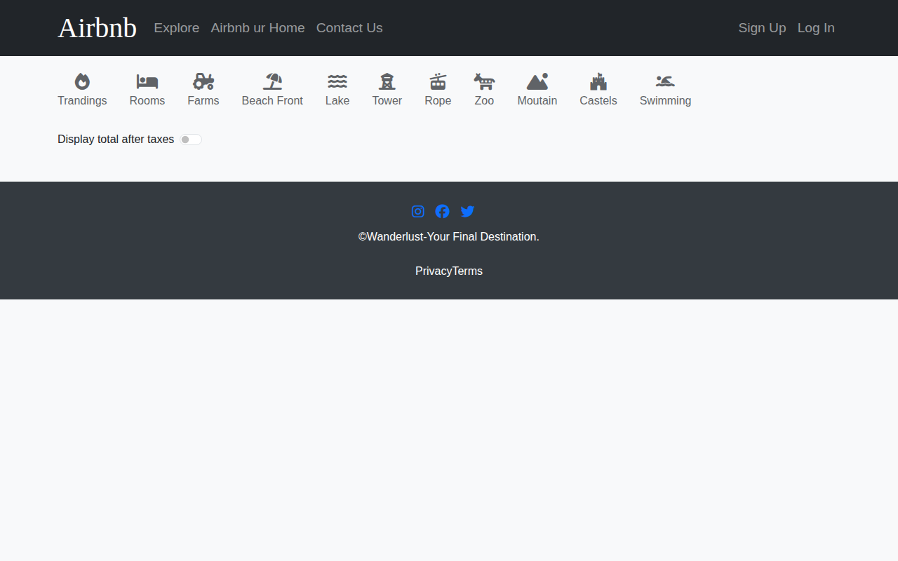
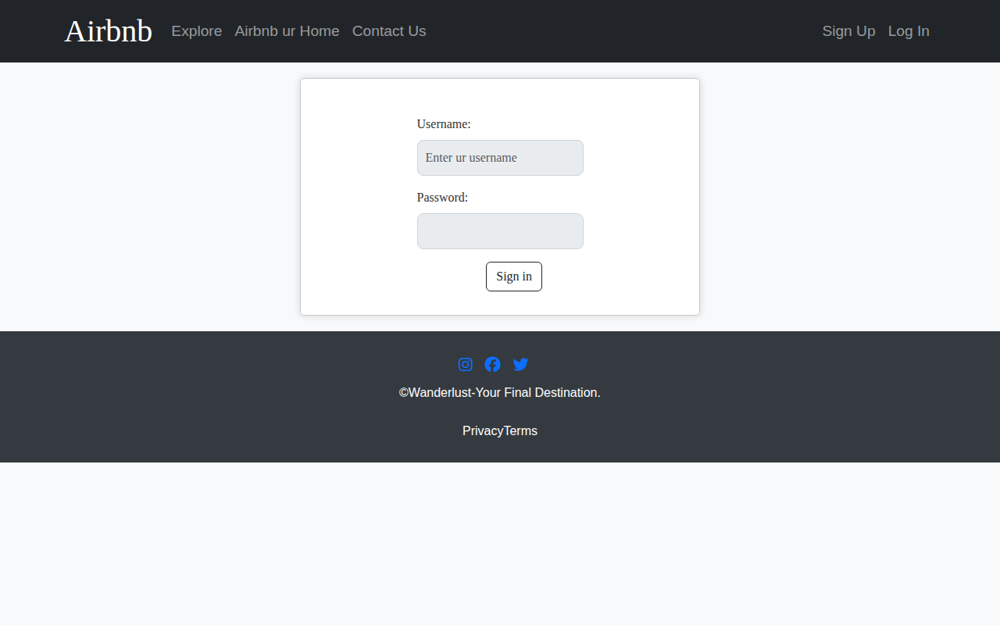
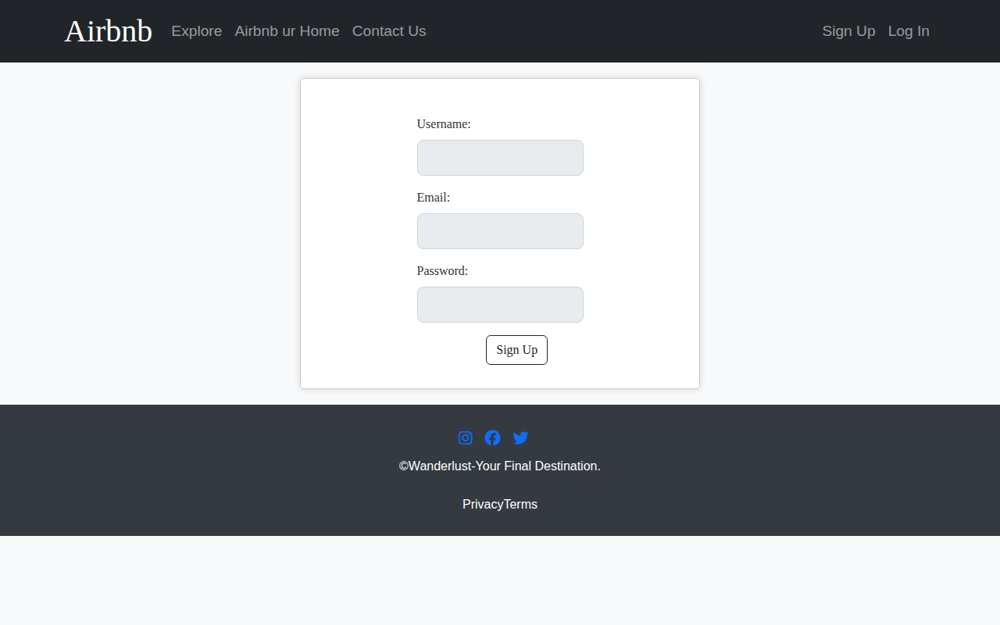
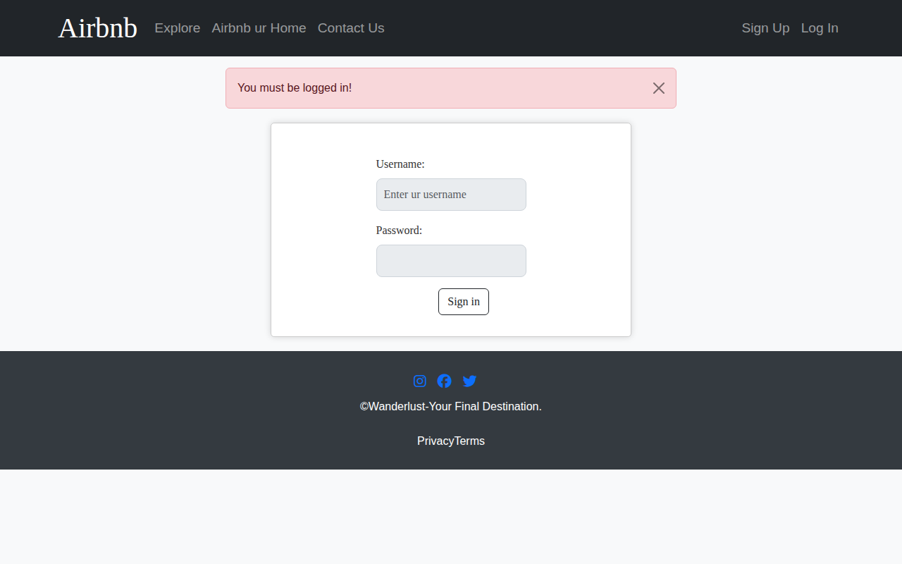

# Wanderlust - Airbnb Clone

A full-stack vacation rental marketplace application built with Node.js, Express, MongoDB, and EJS. This is an Airbnb-style platform where users can list, browse, and review properties.

## Screenshots

### Home Page - All Listings


### User Login


### User Signup


### Create New Listing


## Features

### Core Functionality
- **User Authentication**: Sign up, login, and logout using Passport.js with local strategy
- **Property Listings**: Create, read, update, and delete (CRUD) property listings
- **Image Upload**: Cloudinary integration for storing listing images
- **Reviews & Ratings**: Users can leave reviews with ratings (1-5 stars) on listings
- **Authorization**: Only listing owners can edit or delete their properties

### UI/UX Features
- **Responsive Design**: Mobile-friendly Bootstrap-based interface
- **Filter Categories**: Browse listings by type (Trending, Rooms, Farms, Beachfront, etc.)
- **Tax Toggle**: Display prices with or without taxes
- **Flash Messages**: User feedback for actions (success/error notifications)
- **Interactive Map**: TomTom maps integration for location visualization

## Tech Stack

### Backend
- **Runtime**: Node.js
- **Framework**: Express.js
- **Database**: MongoDB with Mongoose ODM
- **Templating**: EJS with ejs-mate

### Authentication & Sessions
- **Passport.js**: Local authentication strategy
- **passport-local-mongoose**: User model plugin
- **express-session**: Session management
- **connect-mongo**: MongoDB session store
- **connect-flash**: Flash messages

### File Upload & Cloud Storage
- **Multer**: Node.js middleware for multipart/form-data
- **Cloudinary**: Cloud-based image storage
- **multer-storage-cloudinary**: Multer storage engine for Cloudinary

### Validation & Utilities
- **Joi**: Schema validation
- **dotenv**: Environment variable management
- **method-override**: HTTP method override for PUT/DELETE from forms

### Frontend
- **Bootstrap 5**: UI framework
- **Font Awesome**: Icons
- **TomTom Maps**: Map integration

## Project Structure

```
Airbnb-Project/
├── app.js                 # Main application entry point
├── package.json           # Dependencies and scripts
├── schema.js              # Joi validation schemas
├── cloudconfig.js         # Cloudinary configuration
├── middleware.js          # Custom middleware functions
├── .env                   # Environment variables (not in repo)
├── .gitignore             # Git ignore rules
│
├── models/
│   ├── listing.js         # Listing model schema
│   ├── review.js          # Review model schema
│   └── user.js            # User model schema
│
├── routes/
│   ├── listing.js         # Listing routes
│   ├── review.js         # Review routes
│   └── user.js           # User routes
│
├── controllers/
│   ├── listings.js       # Listing controller logic
│   ├── reviews.js        # Review controller logic
│   └── users.js         # User controller logic
│
├── views/
│   ├── layouts/
│   │   └── boilerplate.ejs    # Base layout template
│   ├── includes/
│   │   ├── navbar.ejs         # Navigation bar
│   │   ├── footer.ejs        # Footer
│   │   └── flash.ejs         # Flash messages
│   ├── listings/
│   │   ├── index.ejs         # Home page with all listings
│   │   ├── show.ejs          # Single listing details
│   │   ├── new.ejs          # Create new listing form
│   │   └── update.ejs       # Edit listing form
│   ├── users/
│   │   ├── login.ejs         # Login form
│   │   └── signUp.ejs       # Signup form
│   └── error.ejs            # Error page
│
├── public/
│   ├── css/
│   │   ├── index.css       # Home page styles
│   │   ├── show.css        # Listing detail styles
│   │   ├── form.css        # Form styles
│   │   └── rating.css     # Star rating styles
│   └── js/
│       ├── map.js          # Map functionality
│       └── fomScript.js    # Form scripts
│
├── utils/
│   ├── ExpressError.js    # Custom error class
│   └── wrapAsync.js       # Async wrapper for error handling
│
├── init/
│   ├── data.js            # Sample listing data
│   └── index.js          # Database initialization script
│
└── uploads/              # Local file uploads (temporary)
```

## Prerequisites

- Node.js (v14 or higher)
- MongoDB (local or MongoDB Atlas)
- Cloudinary account (for image storage)

## Installation

1. **Clone the repository**
   ```bash
   git clone <repository-url>
   cd Airbnb-Project
   ```

2. **Install dependencies**
   ```bash
   npm install
   ```

3. **Create environment file**
   
   Create a `.env` file in the root directory with the following variables:
   ```env
   MONGO_ATLAS=mongodb+srv://<username>:<password>@cluster.mongodb.net/wanderlust
   SECRET=your-session-secret
   CLOUD_NAME=your-cloudinary-cloud-name
   CLOUD_API_KEY=your-cloudinary-api-key
   CLOUD_API_SECRECT=your-cloudinary-api-secret
   ```

4. **Start the server**
   ```bash
   node app.js
   # or
   npm start
   # or (with nodemon for development)
   npx nodemon app.js
   ```

5. **Access the application**
   Open your browser and navigate to: `http://localhost:8080`

## API Routes

### Listings
| Method | Route | Description |
|--------|-------|-------------|
| GET | `/listings` | View all listings |
| GET | `/listings/new` | Show create listing form |
| POST | `/listings` | Create new listing |
| GET | `/listings/:id` | View single listing |
| GET | `/listings/:id/edit` | Show edit form |
| PUT | `/listings/:id` | Update listing |
| DELETE | `/listings/:id` | Delete listing |

### Reviews
| Method | Route | Description |
|--------|-------|-------------|
| POST | `/listings/:id/reviews` | Add review |
| DELETE | `/listings/:id/reviews/:reviewId` | Delete review |

### Users
| Method | Route | Description |
|--------|-------|-------------|
| GET | `/signup` | Show signup form |
| POST | `/signup` | Register new user |
| GET | `/login` | Show login form |
| POST | `/login` | Login user |
| GET | `/logout` | Logout user |

## Database Models

### User
- `username`: String (unique, required)
- `email`: String (unique, required)
- `password`: String (hashed via passport-local-mongoose)

### Listing
- `title`: String (required)
- `description`: String
- `image`: Object { url, filename }
- `price`: Number
- `location`: String
- `country`: String
- `reviews`: Array of Review ObjectIds
- `owner`: User ObjectId

### Review
- `comment`: String (required)
- `rating`: Number (required, 1-5)
- `createdAt`: Date
- `author`: User ObjectId

## Middleware Functions

- `isLoggedIn`: Check if user is authenticated
- `isOwner`: Verify listing ownership for edit/delete
- `isReviewOwner`: Verify review ownership for deletion
- `validateListing`: Validate listing form data with Joi
- `validateReview`: Validate review form data with Joi
- `saveRedirectUrl`: Save original URL for post-login redirect

## Sample Data

The project includes a seed script (`init/index.js`) to populate the database with sample listings from various popular destinations:
- Paris, France
- Maldives
- Aspen, USA
- Bali, Indonesia
- New York City, USA
- Zermatt, Switzerland
- Marrakech, Morocco
- Scottish Highlands, UK
- Phuket, Thailand
- Barcelona, Spain

## Environment Variables

| Variable | Description |
|----------|-------------|
| `MONGO_ATLAS` | MongoDB connection string |
| `SECRET` | Session secret for cookies |
| `CLOUD_NAME` | Cloudinary cloud name |
| `CLOUD_API_KEY` | Cloudinary API key |
| `CLOUD_API_SECRECT` | Cloudinary API secret |

## License

This project is for educational purposes.